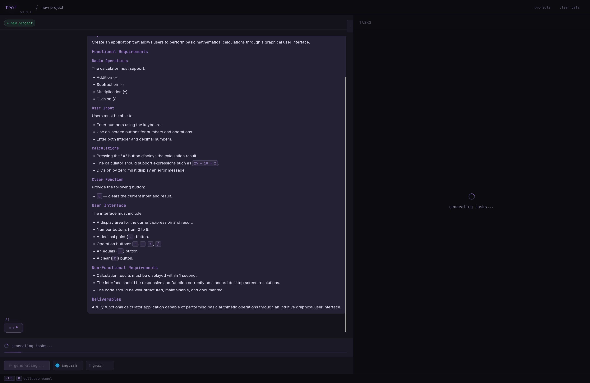
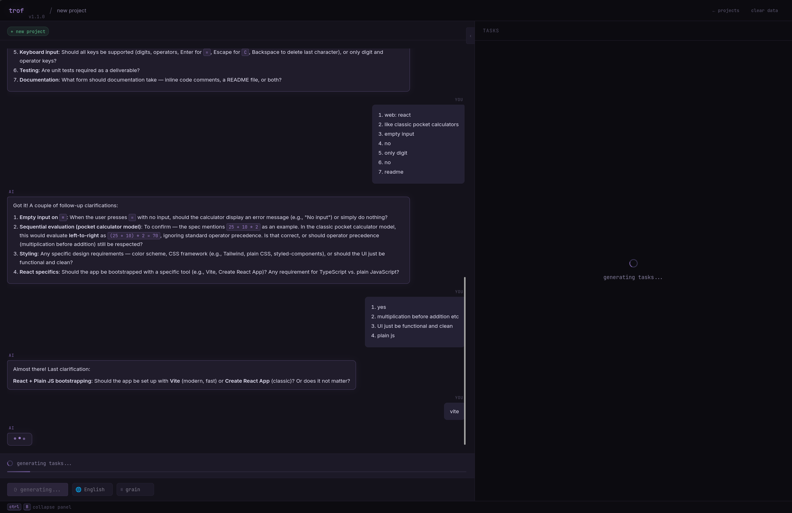
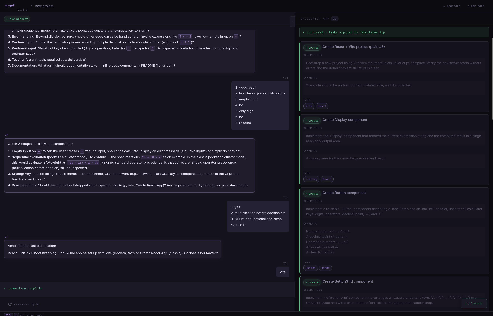
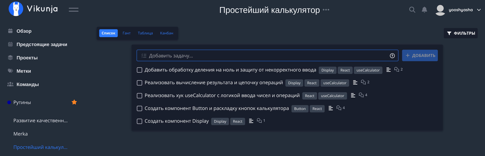
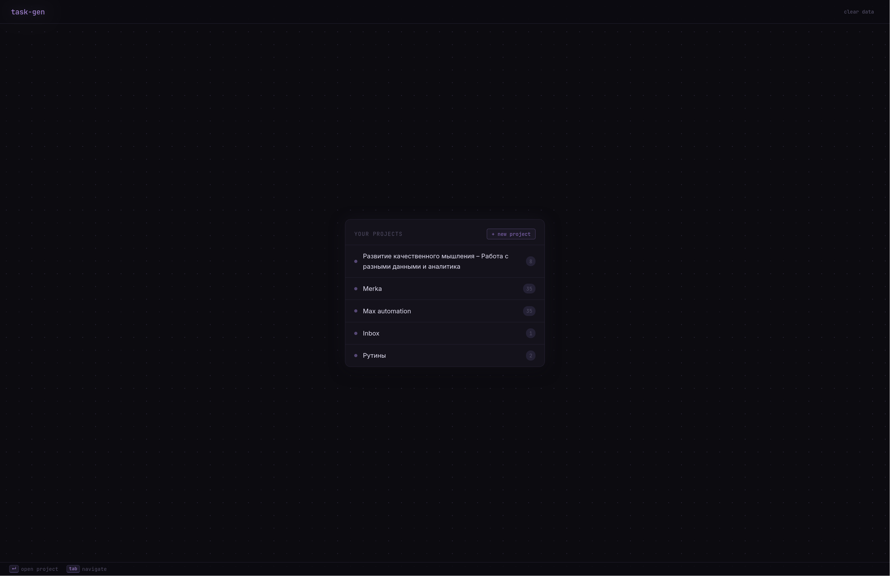

# Taskforge

> Manage your tasks with AI.

Create and edit [Vikunja](https://vikunja.io/) projects quickly and effortlessly with the help of AI. Describe what you want in plain language — the AI breaks it down into tasks, asks clarifying questions when needed, and lets you review every change before it's applied.

## Features

- **Create and edit projects** — start a new project or modify an existing one.
- **AI-assisted breakdown** — the AI turns your description into a structured set of tasks.
- **Clarifying questions** — the AI can ask you follow-up questions to refine the decomposition.
- **Full control over changes** — edit task names, descriptions, comments, and tags, or delete generated tasks before saving.
- **Explicit confirmation** — nothing is written to Vikunja until you confirm.

## Configuration

1. Copy the example environment file:
   ```bash
   cp example.env .env
   ```

2. Set your Vikunja connection in `.env`:

   ```env
   VIKUNJA_URL=https://your.vikunja.instance/api/v1
   VIKUNJA_TOKEN=your-vikunja-token-here
   ```

3. Enable the AI provider you want to use. Uncomment its block in `.env` and fill in the API key.
   For example, to use Anthropic:

   ```env
   AI_KOOG.ANTHROPIC.ENABLED=true
   AI_KOOG.ANTHROPIC.API_KEY=sk-ant-api***AA
   AI_KOOG.ANTHROPIC.BASE_URL=https://api.anthropic.com

   AI_MODEL_ID="claude-sonnet-4-6"
   ```

   Supported providers: OpenAI, Anthropic, Google, OpenRouter, DeepSeek, and Ollama
   (Ollama runs locally and needs no API key).

4. Provide TLS certificates for nginx by placing `cert.crt` and `cert.key` in the `./data` directory.

5. Build and start the stack:
   ```bash
   ./gradlew build -x test && docker compose up -d
   ```

6. Done! Task Manager is now running on your machine at **https://localhost**.

## Example

Here's what a typical project-creation flow looks like.

**1. Describe what you want to build:**



**2. Answer the AI's clarifying questions:**



**3. Review and confirm the generated tasks:**



**4. See the result in Vikunja:**



Editing an existing project follows the same flow.

### Homepage


